# Documentación Final de Software 2

**Autores:**

Estefania Otalvaro Quintero
Maria Salome Gonzales Blandon
Juan Daniel Rodriguez Giraldo

Fecha: Noviembre 2025
Versión: 1.0

# Diagramas UML

## 1. Diagrama de Paquetes
## 📚 Objetivo del Proyecto
El propósito de **ParkEDS** es crear una plataforma que facilite la administración de parqueaderos, automatizando procesos de ingreso, cobro y monitoreo de espacios, además de ofrecer trazabilidad y seguridad en los datos.

---
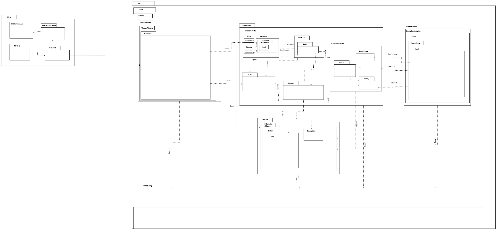

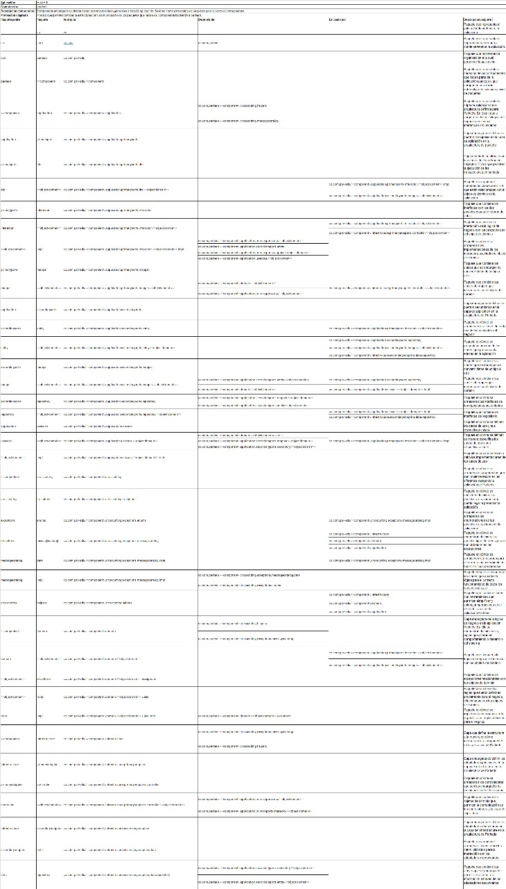

## 2. Diagrama de Componentes

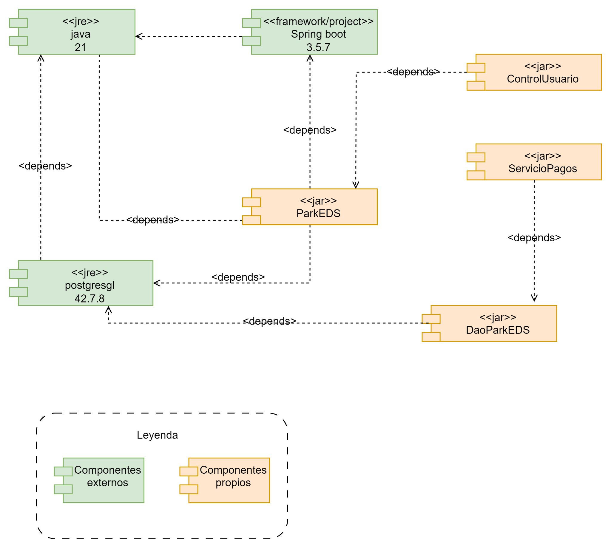

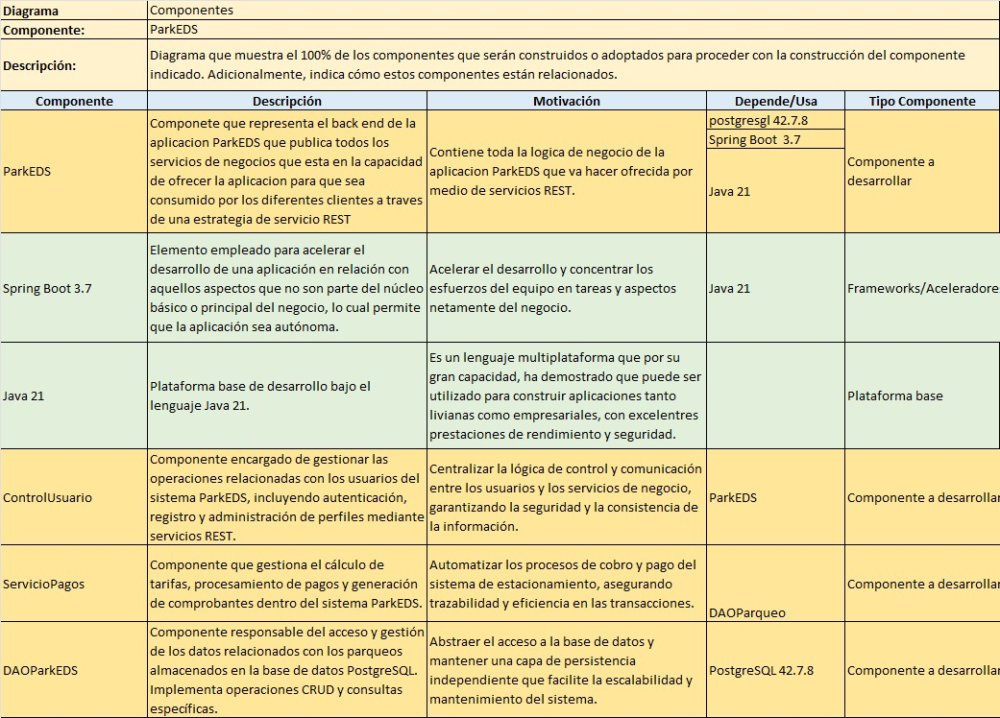

## 3. Diagrama de Secuencia

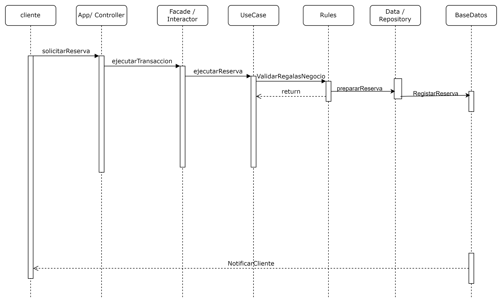

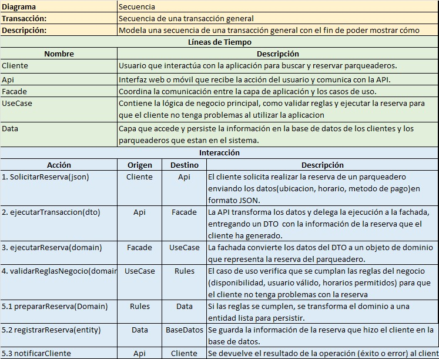

MER

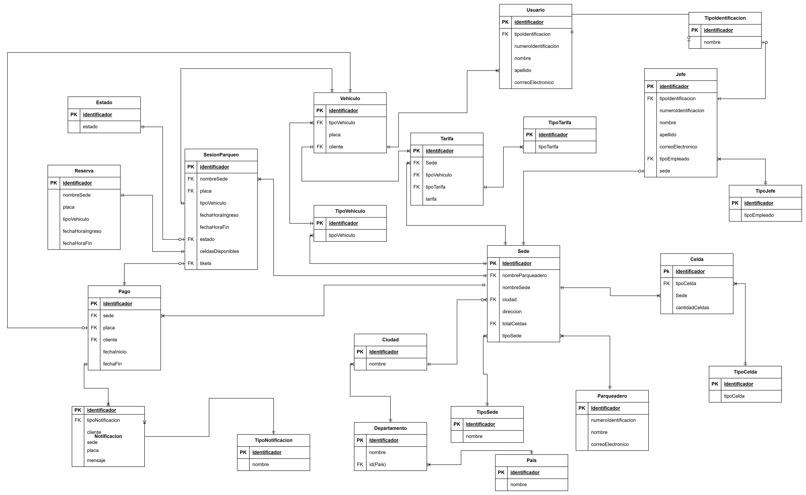

INGRESO DE VEHICULOS

SEDES

DIAGRAMA DE CLASES

AEQUITECTURA

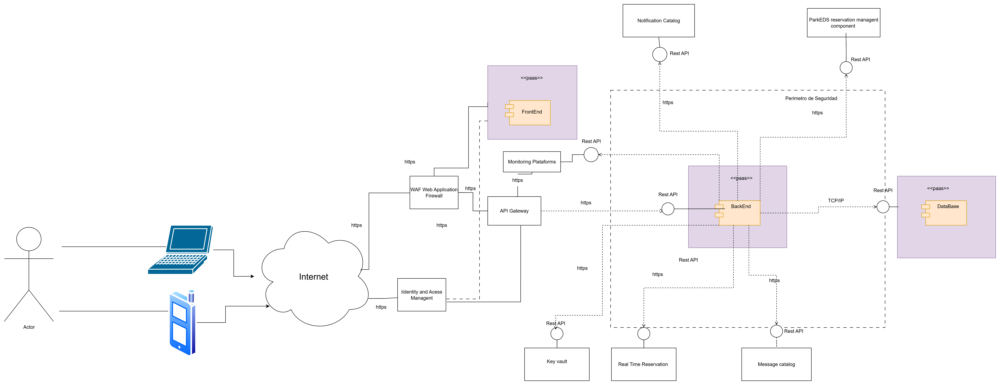

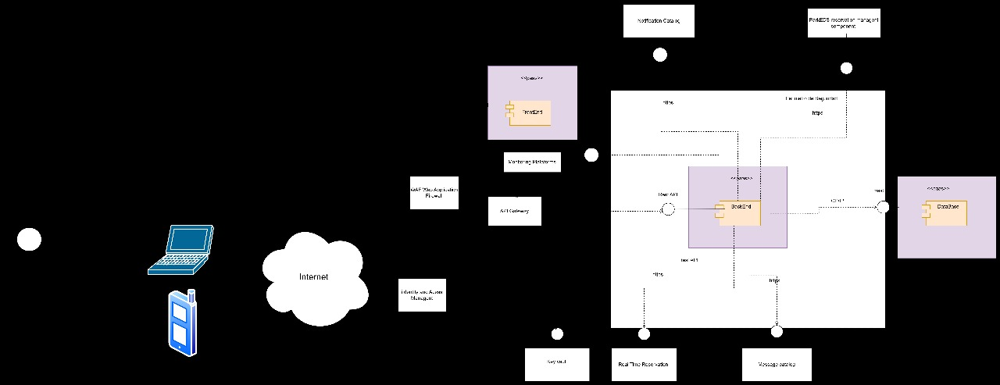

DIAGRAMA DE ESTADOS

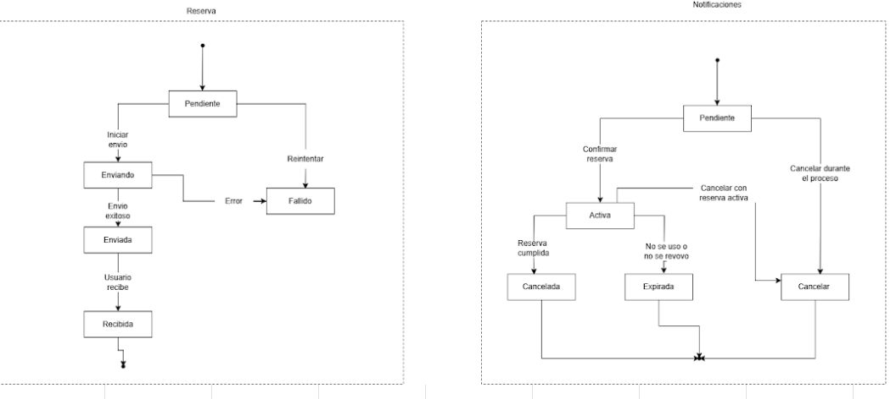

# Modelo 4+1 de Arquitectura del Sistema ParkEDS

El modelo 4+1 es una metodología de documentación arquitectónica que organiza la descripción del sistema en cinco vistas complementarias. Cada una representa un enfoque diferente sobre la arquitectura.

## Vista Lógica

Define la estructura modular del sistema, sus entidades y relaciones principales. Corresponde al diagrama de paquetes e ilustra la organización funcional del software.

## Vista de Desarrollo

Describe la arquitectura interna y los componentes del sistema, así como su implementación. Está representada en el diagrama de componentes.

## Vista de Procesos

Expone la interacción entre componentes, flujos de ejecución, concurrencia y comunicación. Se apoya en el diagrama de secuencia y en las plantillas de documentación asociadas.

## Vista Física

Muestra la distribución de los componentes en la infraestructura física o en la nube, incluyendo servidores, redes y bases de datos.

## Vista de Escenarios (+1)

Integra las vistas anteriores a través de casos de uso representativos, como el ingreso y salida de vehículos o la generación de reportes.

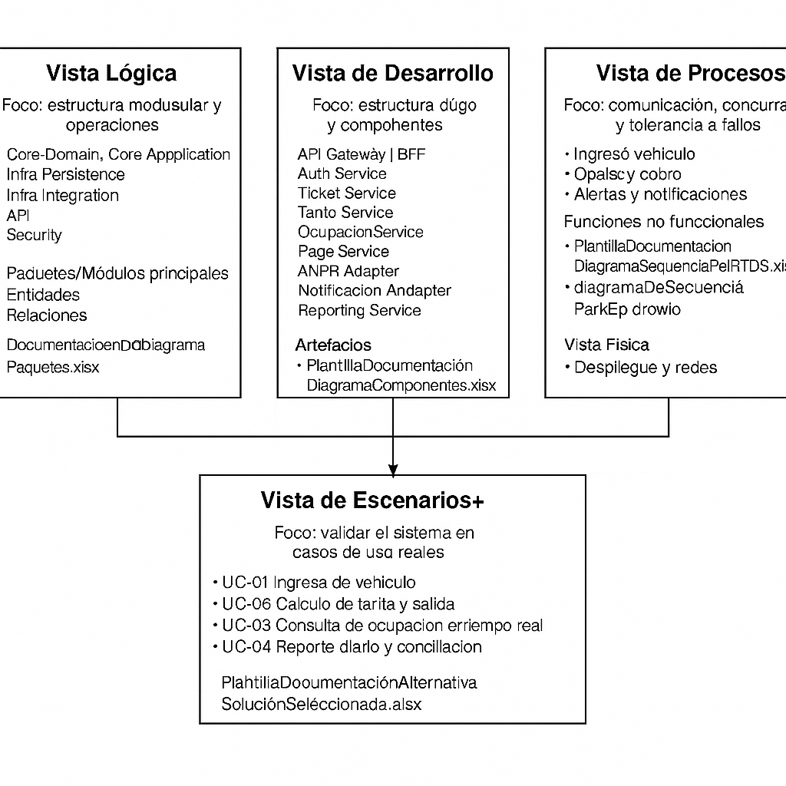

# Resumen General

|  |  |  |
| --- | --- | --- |
| Diagrama | Descripción | Archivo |
| Paquetes | Estructura modular del sistema ParkEDS | DocumentacionDiagramaPaquetes.xlsx |
| Componentes | Interacción entre los módulos y servicios | PlantillaDocumentaciónDiagramaComponentes.xlsx |
| Secuencia | Flujo de eventos del sistema | PlantillaDocumentaciónDiagramaSecuenciaParkEDS.xlsx |

## 🏫 Información Académica
**Universidad:** Universidad Catolica De Oriente
**Programa:** Ingeniería en Sistemas  
**Materia:** Software II   
**Docente:** Wider Farid Sanchez Garzon

---